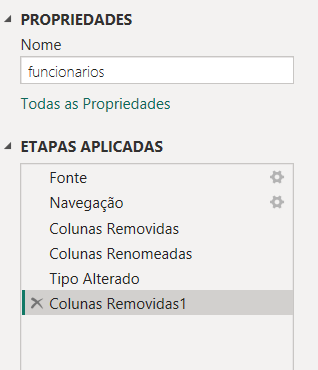
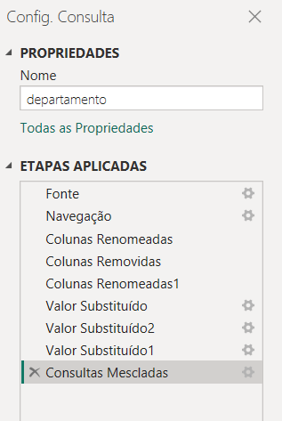
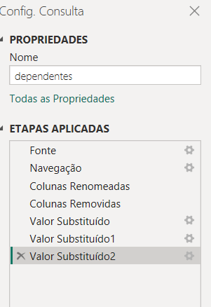
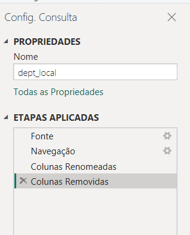
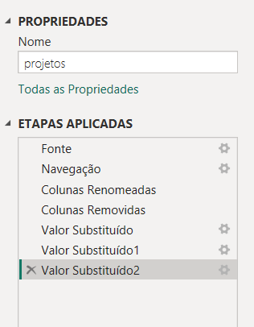
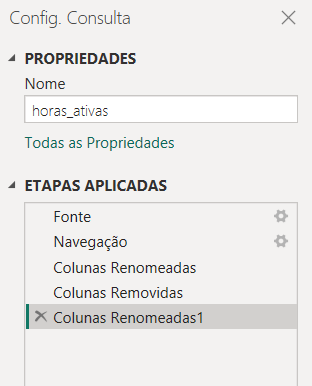
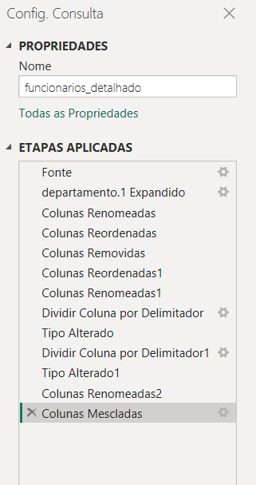
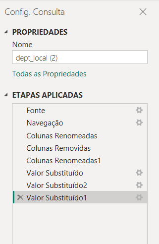

# Desafio DIO_NTTData - Módulo 3 - ETL

## Registro de passos no processo de ETL. 

Passo 1 - Remoção de colunas de metadados

Passo 2 - Colunas renomeadas

Passo 3 - Substitução de alguns valores de texto presentes em algumas colunas.

Passo 4 - Ordenação de colunas

Passo 5 - Divisão de colunas por delimitador

Passo 6 - Reagrupamento de colunas

Passo 7 - Mescla de algumas colunas

## Segue abaixo registro em imagem dos passos realizados. 

### Projeto segue em processo de atualização. 

